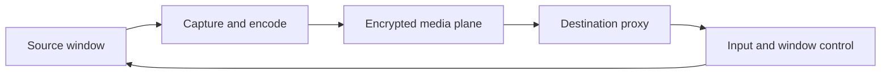

# Seamless-window architecture and roadmap

Status: planned; not available in current releases.

## Product definition

Seamless-window mode lets a user present an individual application window from one trusted UniSpace device as a native top-level proxy window on another device. The source application and process continue running on the source device. UniSpace captures only the selected window, streams its pixels, and routes interaction back to the source.

This is a user-space per-window remoting feature, not a virtual-display driver and not conventional whole-desktop remote desktop. The destination never receives the source desktop wallpaper, Dock, menu bar, taskbar, or unrelated windows.

The first supported release is macOS to macOS. Windows capture and presentation follow only after the macOS architecture and latency targets are proven.

## User experience

1. The user explicitly enables seamless-window mode for a trusted workspace.
2. The user selects **Move Window to…** or drags a supported window through a configured device edge.
3. The destination immediately creates a placeholder proxy in its local coordinate space.
4. The destination acquires the window presentation lease and subscribes to its media stream.
5. The source captures and encodes only that window.
6. The proxy displays the decoded frames and forwards pointer, keyboard, focus, scroll, and resize operations to the source.
7. Closing the proxy ends remote presentation; it does not terminate the source application unless the user explicitly chooses **Close Source Window**.
8. **Bring All Windows Home** returns every remotely presented window to its source presentation.

The source device remains authoritative for application state and window content. The destination remains authoritative for placement of the proxy in its local workspace. A window has only one active presentation controller at a time.

The first release must provide **Move Window to…** as a deterministic fallback. Edge-drag handoff builds on the same lease protocol but is not the only way to move a window.

## Goals

- Stream one application window without streaming the desktop background.
- Make the remote window behave like a normal destination-side top-level window.
- Preserve keyboard, pointer, clipboard, and file-transfer responsiveness.
- Allow presentation to survive transient disconnect and reconnect.
- Keep memory and media queues bounded.
- Adapt frame rate, resolution, and bitrate to visibility and network conditions.
- Preserve mixed-version control when either peer lacks seamless-window support.
- Provide explicit privacy state and a reliable emergency return path.

## Non-goals for the first release

- Audio streaming.
- Arbitrary display or whole-desktop capture.
- Windows source or destination support.
- Application or process migration.
- DRM-protected or system-protected surfaces.
- Login-window, UAC secure-desktop, or Secure Input bypass.
- Multiple simultaneous controllers for one source window.
- Native replacement of every source title bar, menu, tooltip, or transient system surface.
- Dragging a local file directly into an arbitrary control inside a remote window.

Clipboard and verified file movement remain provided by the existing Continuity channels. Seamless-window mode must not duplicate those subsystems.

## Architecture



### Layer responsibilities

| Layer | Responsibilities |
| --- | --- |
| Domain | Window identity, generations, capabilities, bounds, state, presentation leases, lifecycle transitions, protocol limits |
| Application | Window catalog, presentation coordinator, lease ownership, handoff transaction, media subscription, quality feedback, reconnect and rollback |
| Infrastructure | ScreenCaptureKit, VideoToolbox, decoder/renderer, media transport, Accessibility window operations, input injection, permission checks |
| App | Window picker, **Move Window to…**, native proxy windows, device badges, privacy indicators, recovery actions and settings |

Domain and Application code must not import AppKit, ScreenCaptureKit, VideoToolbox, Metal, Core Graphics, or network implementations. Cross-actor models must be value types conforming to `Sendable`, and mutable coordination belongs in actors.

## Window identity and authority

A remote window is addressed by a stable session-scoped identity rather than by a process ID or platform window number alone.

Minimum models:

- `RemoteWindowID`
- `WindowGeneration`
- `WindowDescriptor`
- `WindowFamily`
- `WindowBounds`
- `WindowState`
- `WindowPresentationLease`
- `WindowMediaConfiguration`
- `WindowQualityFeedback`
- `WindowHandoffOffer` and `WindowHandoffCommit`

`RemoteWindowID` is opaque outside the source device. `WindowGeneration` changes whenever a native identifier is reused or the source restarts its capture lifecycle. Messages from an old generation are ignored.

The source is authoritative for:

- title, application identity and icon;
- content dimensions and lifecycle;
- minimized, closed and unavailable state;
- supported resize and input operations.

The destination is authoritative for:

- proxy placement in destination coordinates;
- local visibility and occlusion feedback;
- presentation requests and the current interaction focus.

A lease contains the workspace, source device, destination device, remote window, generation, lease epoch, expiry, and authenticated owner. The highest committed epoch wins. A reconnect cannot resurrect an expired lease or create two active controllers.

## Protocol and capabilities

Capability negotiation extends the existing authenticated peer metadata. Initial capabilities:

- `seamless-window-v1`
- `window-capture`
- `window-input`
- `window-resize`
- `window-dialogs`
- `window-media-h264`
- `window-media-hevc`
- `window-media-datagram`

A peer that does not advertise these capabilities remains fully usable for supported keyboard, pointer, clipboard, and file-transfer behavior.

Reliable authenticated messages carry:

- window catalog snapshots and deltas;
- title, icon, bounds, focus, visibility and lifecycle changes;
- presentation offers, acceptance, commit, release and rollback;
- media configuration and keyframe requests;
- resize requests and acknowledgements;
- quality, visibility and congestion feedback.

Window video is not sent through the existing file-transfer queue. Encoded frames use an independently keyed, replay-protected real-time media path with:

- per-window stream epochs;
- frame and fragment sequence numbers;
- presentation timestamps;
- keyframe markers;
- bounded fragmentation and payload sizes;
- late-frame discard;
- bounded sender and receiver queues;
- independent reconnect;
- authenticated quality feedback.

Reliable keyboard, pointer and lease control retain higher priority than media. Clipboard and file transfer continue using their existing authenticated channels, with bulk file transfer yielding bandwidth to interactive media.

## macOS implementation

### Source capture

Use ScreenCaptureKit to enumerate and select top-level windows. Capture the selected window with a desktop-independent window filter so unrelated desktop content is not included.

The capture lifecycle must:

- react to window close, size and content-scale changes;
- use content/damage rectangles when available;
- request frames only while a lease or local preview needs them;
- lower frame rate for background or mostly occluded proxies;
- pause after a bounded grace period when the destination reports full occlusion;
- request a new keyframe when presentation resumes;
- never assume a minimized window remains capturable;
- avoid hiding, minimizing, parking or moving the source window until the feasibility spike proves the behavior on supported macOS versions.

### Encoding and decoding

Use VideoToolbox hardware encoding when available.

Initial codec order:

1. H.264 low-latency screen-content configuration.
2. HEVC only when both peers advertise support and measurements show a benefit.
3. Software fallback only within explicit CPU and resolution limits.

Do not use B-frames or unbounded lookahead. The sender may drop an obsolete uncoded frame before it enters the encoder. The receiver decodes into a Metal-backed surface or an equivalent bounded hardware path without whole-frame history.

The initial proxy may render source window decorations inside a borderless local container. Replacing source decorations with destination-native chrome is not a first-release requirement.

### Input and window operations

Pointer coordinates are normalized against the exact encoded content rectangle, then transformed through:

1. proxy logical coordinates;
2. destination backing scale;
3. encoded frame dimensions and crop;
4. source content coordinates;
5. source display coordinate space.

The transform version used for an input event travels with that event. Events using an expired transform are rejected or safely remapped; they must not click an unintended location.

The destination applies temporary visual scaling while a resize round trip is pending. The source performs the actual native resize and acknowledges the resulting content size. The destination then replaces temporary scaling with frames encoded at the new dimensions.

Keyboard and pointer injection continues through the existing authenticated input architecture. Accessibility is used only for supported source-window focus, bounds and lifecycle operations.

## Presentation and handoff state

Suggested state machine:

```text
local
offering
awaitingAcceptance
presenting
handoffPending
suspended
returning
released
failed
```

A handoff is transactional:

1. Reserve the next presentation epoch.
2. Destination creates a placeholder.
3. Destination accepts and becomes the pending lease owner.
4. Media subscription starts and requests an IDR frame.
5. Source commits the lease after the destination is ready.
6. Previous presentation releases only after commit.
7. Timeout or disconnect rolls back to the last committed owner.

Pointer edge detection uses the existing configured device topology. Window bounds are converted using logical coordinates and per-display scale, not raw pixels. A handoff preserves the pointer's normalized position within the dragged title region where possible.

## Security and privacy

- Seamless-window mode is off by default.
- Every source device requires Screen Recording permission.
- Remote focus, resize, and input require the existing Accessibility/Input Monitoring permissions.
- Capture is limited to a user-selected or explicitly moved window.
- A visible indicator identifies the source device and active remote presentation.
- The user can denylist applications from remote presentation.
- Protected or blank capture surfaces fail closed without retry loops.
- Window titles may be omitted from normal logs; pixels, keystrokes and clipboard contents are never logged.
- Media derives independent session keys and replay state from the existing trusted workspace identity.
- Malformed lengths, fragments, coordinates, dimensions, timestamps and epochs are rejected before allocation or native API calls.
- Emergency return releases remote input, presentation leases, pressed keys and pointer suppression.

## Milestones

| Milestone | Deliverable | Exit criteria |
| --- | --- | --- |
| `SEAM-001` feasibility spike | One selected Mac window captured, encoded, transported and rendered in a second Mac proxy | Architecture decision records measured latency, resource use, minimized/off-screen behavior and a go/no-go decision |
| `SEAM-002` media transport | Independently keyed bounded real-time media path | Late frames drop safely; control and input retain priority; reconnect requests a clean keyframe |
| `SEAM-003` proxy rendering | Destination AppKit proxy and hardware decoder | Correct lifecycle, focus, placeholder, visibility feedback and deterministic cleanup |
| `SEAM-004` input mapping | Pointer, buttons, scroll and keyboard routed through versioned transforms | Correct targeting under movement, crop, scale and reconnect |
| `SEAM-005` presentation lease and handoff | Single-owner lease, **Move Window to…**, edge handoff and rollback | No duplicate controller; interrupted handoff returns to the last committed owner |
| `SEAM-006` resize and scale | Bidirectional resize with temporary local scaling | Stable resizing without feedback loops across Retina and non-Retina displays |
| `SEAM-007` source capture lifecycle | Catalog, close, focus, occlusion, dialog and source-restart handling | No stale native identifiers, orphan capture streams or leaked encoder sessions |
| `SEAM-008` macOS hardening | Permission UX, denylist, recovery, performance and compatibility coverage | macOS release gates and real-device acceptance pass |
| `SEAM-009` Windows capture | Graphics Capture/Media Foundation source and Windows proxy compatibility | Begins only after macOS architecture is accepted; not part of version one |
| `SEAM-010` end-to-end acceptance | Cross-device soak, fault, security and performance validation | All quality targets and recovery scenarios pass |

The milestones are ordered. Do not start `SEAM-009` until `SEAM-001` through `SEAM-008` establish a stable macOS protocol and lifecycle.

## Acceptance targets

The first macOS release must demonstrate:

- 1080p at 30 frames per second on a supported LAN.
- Less than 80 ms p95 glass-to-glass latency under the documented test conditions.
- No material pointer or control degradation while media is active.
- Correct pointer and resize mapping across mixed-DPI displays.
- Clean disconnect/reconnect recovery without duplicate presentation ownership.
- Bounded memory independent of session duration.
- No desktop background or unrelated window pixels in captured output.
- No frame, pixel, title, key or clipboard content in normal logs.
- Existing control-only peers remain compatible.

Measurements must record hardware, macOS version, codec, resolution, frame rate, bitrate, network path, loss, CPU, GPU, memory, queue depth, encode time, network time and decode/presentation time. An aggregate latency number without stage timings is insufficient.

## Test strategy

### Domain

- identity and generation reuse;
- lease ordering, expiry and split-brain prevention;
- valid and invalid lifecycle transitions;
- bounded dimension, coordinate and fragment validation;
- capability and mixed-version negotiation.

### Application

- offer, accept, commit, release and rollback;
- simultaneous handoff attempts;
- disconnect during every handoff phase;
- focus and resize race handling;
- stale transform and stale media-epoch rejection;
- visibility throttling and keyframe recovery;
- workspace leave and application shutdown.

### Infrastructure

- ScreenCaptureKit single-window filtering;
- VideoToolbox hardware and bounded fallback paths;
- corrupted, missing, duplicated, reordered and late media fragments;
- encoder and decoder restart;
- Retina/non-Retina coordinate transforms;
- capture permission revocation;
- window close, minimize, resize and source process exit;
- input/control latency while media and file transfer are active.

### UI and real devices

- explicit enablement and permission guidance;
- **Move Window to…**;
- drag through each configured device edge;
- placeholder, reconnect, failure and return-home states;
- keyboard navigation and VoiceOver labels;
- Reduce Motion behavior;
- two-Mac LAN and Tailscale acceptance.

## Delivery rules

The merged Continuity foundations are prerequisites, not a reason to combine the implementation into one pull request:

- UniSpace PR #30 supplies encrypted resumable file transfer and its isolated content path.
- UniSpace PR #33 supplies active-peer clipboard sharing.
- Macifier PR #30 supplies Windows interoperability, input and the Windows companion foundation.
- Macifier PR #32 hardens encrypted control reconnection.

Seamless-window work should be delivered as small pull requests corresponding to the `SEAM-*` milestones. Every protocol change includes malformed-input tests and explicit limits. Every platform implementation depends on Application protocols rather than leaking framework types into Domain or Application.

The first implementation branch begins with `SEAM-001` and must end in a measured architecture decision, not production UI polish.

## References

- [Apple: ScreenCaptureKit](https://developer.apple.com/documentation/screencapturekit)
- [Apple: desktop-independent window filtering](https://developer.apple.com/documentation/screencapturekit/sccontentfilter/init(desktopindependentwindow:))
- [Apple: VideoToolbox](https://developer.apple.com/documentation/videotoolbox)
- [Apple: Encoding video for low-latency conferencing](https://developer.apple.com/documentation/videotoolbox/encoding-video-for-low-latency-conferencing)
