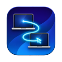
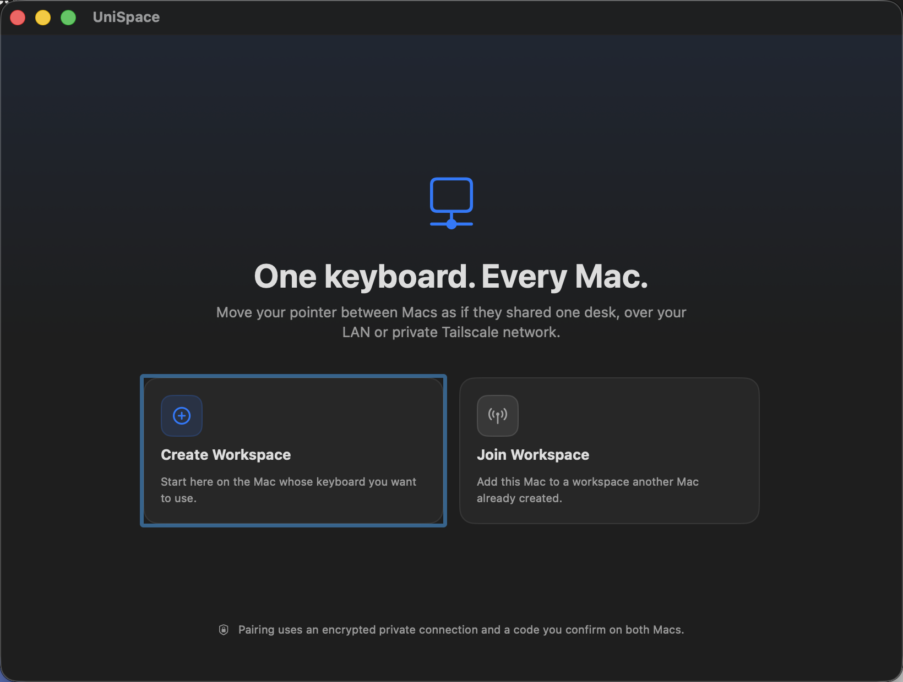
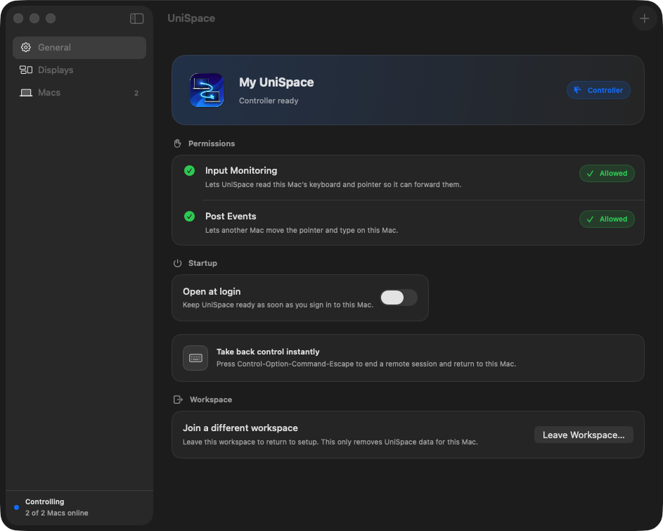

<p align="center">
  
</p>

<h1 align="center">UniSpace</h1>

<p align="center">
  <strong>One keyboard. Every Mac.</strong><br>
  Move your pointer between up to four Macs as if they shared one desk—over your LAN or private Tailscale network.
</p>

<p align="center">
  <a href="https://github.com/layatai/unispace/releases/latest"></a>
  
  
</p>

<p align="center">
  <a href="https://github.com/layatai/unispace/releases/latest"><strong>Download the latest release</strong></a>
  ·
  <a href="#quick-start">Quick start</a>
  ·
  <a href="#networking">Networking</a>
</p>

<p align="center">
  
</p>

UniSpace is a native macOS Dock and menu-bar app for sharing one Mac's keyboard and pointer with your other Macs. Arrange their displays the way they sit on your desk, then cross a touching edge to move control to the next Mac.

## Built for a shared desk

- **Natural handoff:** move through a configured display edge to control another Mac, then cross back to return.
- **LAN or Tailscale:** discover nearby Macs with Bonjour or connect directly with a MagicDNS name or Tailscale IP.
- **Responsive under imperfect networks:** trusted sessions prefer QUIC, fall back to TCP, and keep replaceable pointer motion separate from reliable keyboard, button, drag, and scroll events.
- **A safe way home:** press `Control-Option-Command-Escape` at any time to stop remote control and return locally.

<p align="center">
  
</p>

<p align="center"><sub>Controller ready with two Macs online, required permissions granted, and the emergency return shortcut always visible.</sub></p>

## Quick start

1. [Download the latest release](https://github.com/layatai/unispace/releases/latest), open the DMG, and move UniSpace to Applications.
2. Launch UniSpace on every Mac and grant **Input Monitoring** and **Post Events** when prompted.
3. Choose **Create Workspace** on the Mac whose keyboard and pointer you want to use.
4. Choose **Pair New Mac** on the controller, then **Join Workspace** on the other Mac.
5. Select the controller over the LAN, or enter its MagicDNS name or Tailscale IP. Confirm the same six-digit code on both Macs.
6. Open **Displays**, drag the display cards so their edges touch, and move the pointer through that edge.

To join a different workspace later, open **General → Workspace**, choose **Leave Workspace…**, then return to setup and select **Join Workspace**. This removes only the local workspace membership and Keychain key; macOS permissions remain unchanged.

## Control and reconnection

Keyboard input, pointer buttons, dragging, scrolling, modifiers, and shortcuts follow the active Mac. When a connection is interrupted, UniSpace anchors the controller pointer and drops input rather than applying it to the wrong Mac. If the peer reconnects within five seconds, the remote session resumes; otherwise control safely returns locally. The emergency shortcut remains active while reconnecting.

## Networking

Bonjour handles automatic discovery on a trusted local network. Across Tailscale, enter the controller Mac's MagicDNS name or Tailscale IP when joining or editing a Mac's connection address.

| Port | Protocol | Purpose |
| --- | --- | --- |
| `61337` | TCP | Pairing and workspace-key exchange |
| `61338` | UDP, then TCP fallback | Encrypted trusted-session control channel |
| `61339` | UDP | Replaceable low-latency pointer motion |

Allow these ports through any host or tailnet firewall between participating Macs. Reliable input and control messages remain on the trusted control channel even when the pointer-motion lane is unavailable.

## Security and privacy

- Pairing requires a matching code and approval on both Macs.
- The workspace key is transferred only after an ephemeral key exchange.
- Peer sessions derive per-connection keys, authenticate handshakes, encrypt traffic with ChaCha20-Poly1305, and reject replayed messages.
- Workspace secrets and each installation's QUIC transport identity are stored in Keychain.
- Raw keyboard and pointer events are never logged.

## Current scope

UniSpace forwards standard pointer movement and buttons, scrolling, keyboard keys, modifiers, shortcuts, and public macOS trackpad gestures such as pinch, rotate, swipe, and smart magnify. It intentionally does not provide screen sharing, clipboard or file transfer, an internet relay, Touch ID or power-button forwarding, login-window control, Secure Input bypasses, or OS-reserved Mission Control and desktop gestures.

<details>
<summary><strong>Build and test from source</strong></summary>

### Requirements

- macOS 14 or newer
- Xcode 26.6 or a compatible Swift 6 toolchain
- XcodeGen 2.46 or newer
- Input Monitoring and Post Events permissions on every participating Mac

```sh
./Scripts/test.sh          # full suite, including the signed UI launch test
./Scripts/test.sh --unit   # domain, application, and infrastructure tests
./Scripts/build.sh --universal
```

The generated Xcode project is derived from `project.yml`; edit the YAML and regenerate instead of hand-editing `project.pbxproj`.

</details>

<details>
<summary><strong>Create a signed and notarized release</strong></summary>

Store notarization credentials in a `notarytool` Keychain profile, then run:

```sh
UNISPACE_NOTARY_PROFILE=your-profile ./Scripts/release.sh
```

The script also accepts `APPLE_ID`, `APPLE_PASSWORD`, and `APPLE_TEAM_ID`, or the corresponding App Store Connect API-key variables. It produces a versioned universal DMG, then validates signing, stapling, and Gatekeeper acceptance.

</details>
